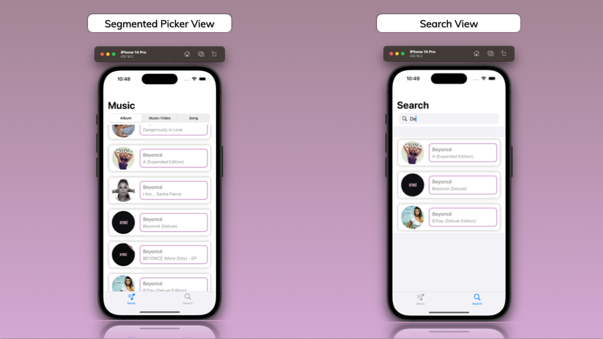

# iTunesMusicExplorer

iTunesMusicExplorer is an iOS app for searching and browsing music artists and tracks using an API from iTunesMusic. Built with SwiftUI and the MVVM design pattern, it offers an optimized user experience with image lazy loading, caching, and non-blocking UI.

## Features

- Search and browse music by artist name, track name, and collection name
- Segmented Picker control by either Album, Music-Video or Song
- Image lazy loading and caching for improved performance
- Async network calls to avoid UI freezing
- Pull-down refresh and search field for enhanced navigation

## Showcase

